# Using the GUI

This option is more simple than the [scitq-manage](manage.md) option but requires a browser access to scitq server (and thus require that you have access to a trusted IP as defined in [security](install.md#security), maybe a VPN or a proxy or an SSH tunnel).

!!! note
    You will notice there is no way to add a new task with the GUI: this is a design choice, a task is basically a command from the command line (a non-interactive program), thus the command line is the ideal place to test and hence queue this command.

## Reaching the GUI

If the scitq server name is `scitq.mycompany.com`, then the GUI URL is `http://scitq.mycompany.com:5000/ui/`.
It should look like that:

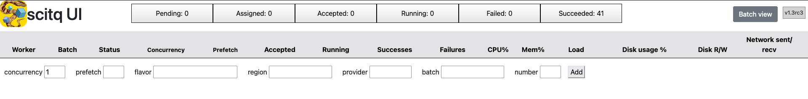

This is the worker screen, it is empty because there are no workers. In the screenshot, most tasks counter are set to zero which means no tasks are queued or running.

## worker screen (http://.../ui/)

So if the worker screen is empty, it is time we recruit one. Let us do that: at the bottom of the start screen there is line like this, let us fill it and submit:

### Recruiting
!!! note
    This will not work if you have not properly set up your [provider](specific.md#providers-configuration).

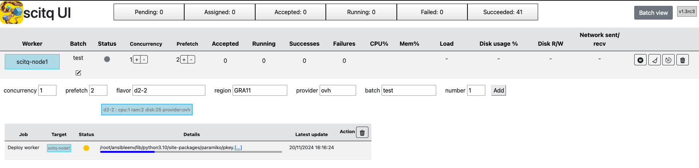

`concurrency`
:   leave that to 1 for now. This is the number of task the worker should execute concurrently (together).

`prefetch`
:   leave that to 0, this is an optimisation setup, we do not need that for now.

`flavor`
:   this is OpenStack wording for the instance model (Azure call that size). `d2-2` is the smallest available instance for OVH (1 vcore, 2 GB mem and 25GB hard drive). Obviously not fit for production, that is enough for a test. Azure equivalent is `Standard_DS1v2`. You can also specify flavor using protofilters with something like `auto:cpu>=2`, see [protofilters](manage.md#using-protofilters-new-in-v123). You can also click in the empty field and you'll see a drop list to show all the different flavors available. This list will be restricted if you fill the provider or region field.

`region`
:   when you set your provider up, you established a list of available regions (and you deployed your SSH key on them), pick one of them. For OVH, `GRA11` is a fine choice here if it is available for you, but really, any will do. For Azure, we suggest `swedencentral` which, as the time of this writing, is the cheapest region in Europe.

`provider`
:   choose between `ovh` and `azure` here. It is likely to have auto field if you chose a flavor or a region before.

`batch`
:   if you read the [usage batch chapter](usage.md#batch--b), you should be familiar with that. It is simply a character string that should be shared between some tasks and some workers. The workers of a certain batch will only take tasks from this particular batch. If you have already queued some tasks (not too big hopefully, remember we are with a very small instance), you can choose the same batch. Otherwise, take `mybatch`, that will do. Anyway it is extremely easy to move a worker from one batch to another.

`number`
:   this is the number of workers we will recruit with those parameters. Let us stay to 1 for now.

now click add.

You should see a line `node1` coming up quickly, but with a grey dot, sign that the worker is not ready yet. You will also see a new Job, called deploy, with a progress bar. Clicking on the three dots on the text line that appears above the progress bar, you will see ansible output live and then after ~2 minutes, the job should turn green and the worker dot should turn blue and you should see that:

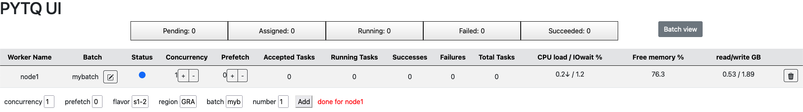


### Managing workers

Here are the different options to manage interactively workers. 

!!! note
    Workers are also managed automatically by scitq *if you recruited them like we just did*: once they have started working (they have started a first task), if their batch becomes empty and they stay idle for 5 minutes, they will launch the idle callback and scitq will delete them - delete them from the worker screen and scitq database and also delete them in the provider space. This does not happen with permanent workers (i.e. manually deployed workers).

#### Changing the batch
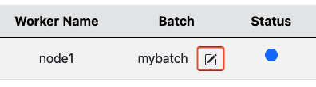

You can edit the batch. This will instruct the worker to accept tasks from a new batch (if some tasks remain (accepted or running) from previous batch, they will finish normally).

#### Concurrency
Just right of batch, you will find the concurrency +/- buttons. Concurrency is the number of tasks allowed to run simultaneously on the worker. Increasing the concurrency will have an instant effect: it is always easy to accept more tasks. But decreasing the concurrency will not be instant: this will just prevent some new tasks to replace the finishing tasks so as to adjust the number of running tasks to the new concurrency. If you want to kill the running tasks, you should go to task management.

#### Prefetch
Just right of concurrency is the prefetch parameter. Prefetch is an optimisation for tasks that have a long input fetching time (like some public data that may take a long time to download). Prefetch is the number of supplementary tasks that will be assigned to the worker, in addition to the currently running tasks, so that the worker may download input for this tasks in advance.

!!! note
    Increasing prefetch can really be helpful when input download is slow but it has a drawback: if the execution time of tasks is not homogenous, you may end with some idle workers while others have a certain number of prefetched tasks not yet launched. Just like before, decreasing the prefetch setting will not free those prefetched tasks, you will have to cancel them and relaunch them manually so that they maybe distributed to idle workers.

#### Destroy (trash icon)
Last, on the right end of each worker a button with a trash icon may trigger the worker deletion. On a cloud deployed worker, this will delete the worker in base, unlink - but not delete - the jobs related to that worker, and trigger the Ansible code to destroy the instance in your provider cloud infrastructure.

On a manually deployed worker this is not recommanded and it will not do much. It will delete the worker in base, but as the worker cannot be uninstalled by Ansible, it will keep working, and will automatically redeclare itself to scitq - thus reappearing instantly.

## task screen (http://.../ui/task)
The task screen may be reached clicking on one of the button in the top bar of the worker screen:


Please, keep the worker screen available in a different tab (this should be the case automatically), as we will need to switch back to it at one point.

It looks like this and is a fairly sophisticated screen that enable a lot of actions:
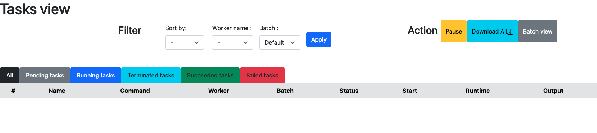

Just to explain what is going on, we will launch a task in the "test" batch (no worker there) to see what is going on. To keep things simple we will queue a simple shell command:

```bash
sh -c 'sleep 10 && echo One && sleep 20 && echo Two && sleep 40 && echo Three'
```
This wait 10 seconds then display "One", wait another 20 seconds and display "Two" then another 30 seconds and display "Three".

To launch it (for details see [usage](usage.md#queuing-a-task)), simply:
```bash
scitq-launch -b test -d ubuntu:latest sh -c 'sleep 10 && echo One && sleep 20 && echo Two && sleep 40 && echo Three'
```

NB: this command will work if the environment variable SCITQ_SERVER is set and points to your actual scitq server, if not add `-s <name or address of scitq server>` before sh. If it is not properly set you will get this exception:
```python
WARNING:root:Exception when trying to post: HTTPConnectionPool(host='127.0.0.1', port=5000): Max retries exceeded with url: /tasks/ (Caused by NewConnectionError('<urllib3.connection.HTTPConnection object at 0x7ff09ffbf430>: Failed to establish a new connection: [Errno 61] Connection refused'))
```
Now, if you click on "All" tab in the task screen (and you wait a maximum of 5 seconds) you should see this:
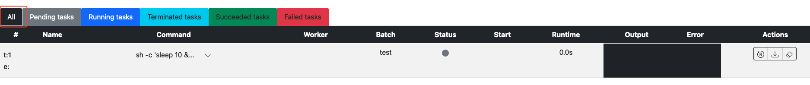

This task has a grey dot, which means it is in pending state (which will show if you hover the mouse abobe the grey dot). The reason for this is that there is no worker in its batch and it cannot be assigned. To change that, we have to move our existing worker to its batch, like it was explain in [worker screen](#changing-the-batch):

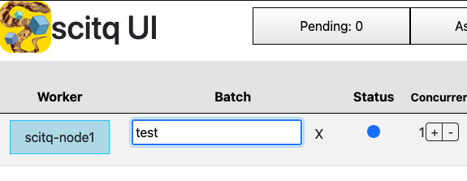

Valid with enter (it may take 1 seconds or 2 to show the change) and go back to the task, the dot turned blue (running):
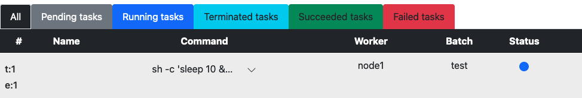

And very soon, something comes up in the error column:
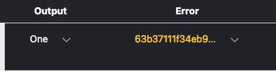

If you click on the V shaped arrow right of the error text, you will expand the text:
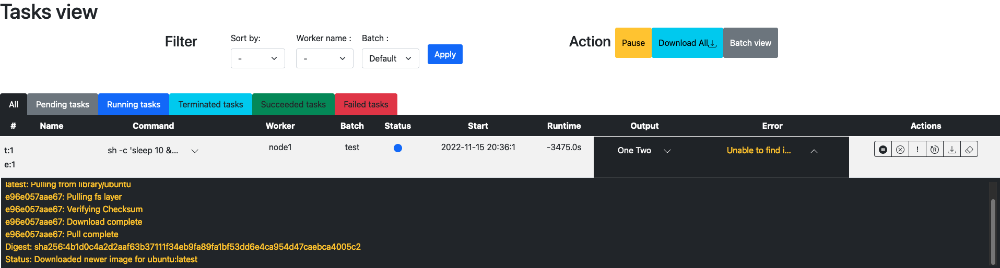
If you do that quickly enough, you'll notice the text is (almost) live. It is updated every 5 seconds or so. This is not really an error, it just displays the stderr (standard error) flow from the docker command, which is reporting the download of the docker image we have chosen.

You can expand the stdout (standar output) flow of the command as well, and you will see the One Two Three words we can expect. And at one point the blue dot will turn green (succeeded).
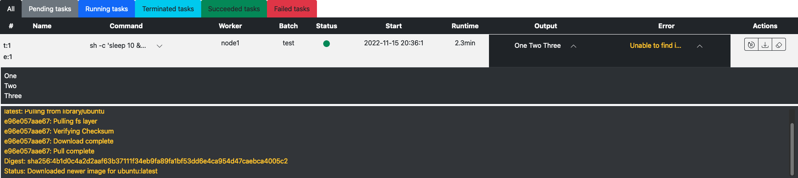
 
If we leave things like that, in 5 minutes, scitq will destroy our worker: the worker is idle and there are no more tasks in the batch.

In case you did not see properly the texts change, let's re-run the task, which is done clicking here:
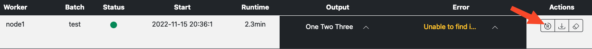

You should see the dot cycling once more through grey, blue (then the text appear, and you'll see it better if you expand the output cell), and green. But no more error flow because our docker image was already there so it need no download this time.

There are three other thing that can be done in that screen:
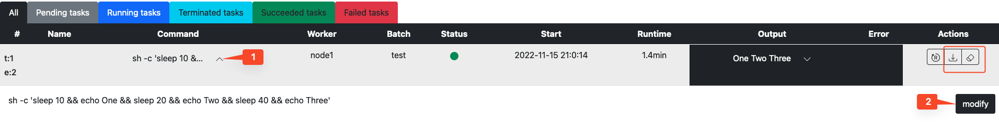
First as highlighted with 1/2 numbers you can expand the command to see it completely and modify it. Modification will also reset the task in pending state which can be handy notably if the task failed (red dot). You can experience with that by mispelling `echo` (remove the o for instance) command for instance in the shell script.
Second, you have two icons (squarred in red in the above screenshot), a download option to download the outputs (stdout and stderr) of the task, and a delete icon to delete the task.

Another thing you can do is play with the colored tabs with the different possible states of the task, they will only display the tasks with the corresponding color of the dot (se green tab should display the green dotted task).

When the task is running, you have three extra action button: 
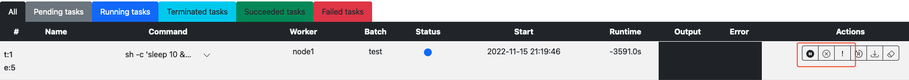

The three buttons can respectively: 

- pause the task, 
- stop the task (SIGTERM or `docker stop`), 
- and kill the task. (SIGKILL or `docker kill`)

## batch screen (http://.../ui/batch)

The batch screen can be reached by clicking on the "Batch view" button on the top right part of the worker screen.

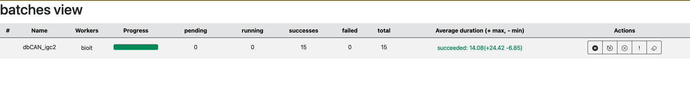

The batch screen is meant to be a sumary of the global state of the different tasks. It can also perform several actions:

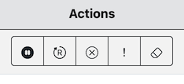

The pause action enable to pause the batch: it pauses all the workers and the tasks. There are two kind of pauses: the simple pause (batch only pause) or the complete pause (batch and task pause). The simple pause simply prevents pending tasks from being attributed and launched, letting running tasks end normally, the batch and task pause will also send the pause signal (SIGTSTP or `docker pause`) to the different running tasks. 

The go action do the reverse of the pause action.

The stop and kill action will send the corresponding signals to all running task.

The last action is the delete action. This will remove delete all tasks (without stoping running tasks). Once all your tasks are done, no need to clutter the database with the past, you can clean.
