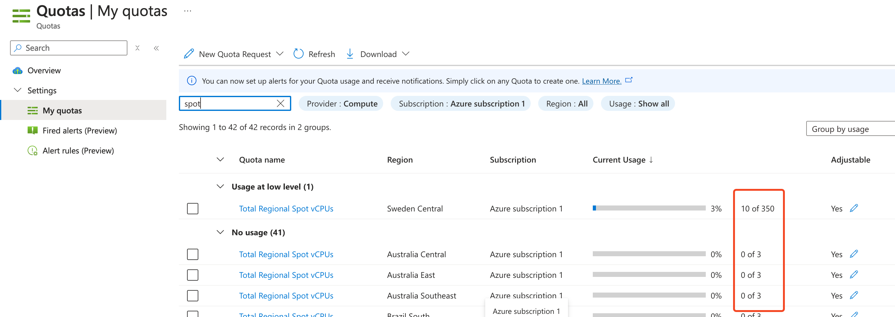

# Specific configurations

## Data management configuration

### Using NFS

NFS has been used since the beginning of scitq usage, but we tend to not use it anymore as NFS is very likely to create some bandwidth bottlenecks. Its usage is deprecated and it will be removed in a future version.

NFS is hardcoded to be mounted on `/data` and as for now there is no way to change that easily as this directory will be used in the NFS server, in the workers and in the container (dockers) where your tasks are launched.

It is incompatible with `use_cache` option (results could be unpredictible).

#### Changes in scitq server ansible configuration (`/etc/ansible/inventory/02-scitq` by default)

If you use NFS just set up `nfs_server` with some short name for your server and `nfs_server_address` with the IP or name with which your workers will see your NFS server. Those variables are in `[scitq:vars]` as explained in [Configure ansible components](install.md#configure-ansible-components).

Your server short name should also be added in a `[managers]` section.


#### Additional steps on scitq server

You should also add the short name of your nfs in your ssh config file, edit or create `/root/.ssh/config` and add those lines:
```init
Host mynfsserver
Hostname mynfsserver.my.domain
```
(of course adapt mynfsserver and mynfsserver.my.domain to the real name and FQDN name of your NFS server)

Next copy your public ssh key to the server, either using this:
```bash
ssh-copy-id mynfsserver
```
Or if you cannot ssh as root with a password on this server, adding the content of your public key (`/root/.ssh/id_rsa.pub`) in `/root/.ssh/authorized_keys`.

In the end, you should be able to ssh directly to your NFS server with:
```bash
ssh mynfsserver
```
and login without any password.

#### Additionnal steps on NFS server

On the NFS server itself, you should install NFS of course:

```bash
apt install nfs-server
systemctl enable nfs-server
systemctl start nfs-server
```

Next you should change your `/etc/exports` file to add some `/data` export. 
A minimal exports file could be:

**/etc/exports**:
```fs
/data   127.0.0.1(rw,sync,no_subtree_check,no_root_squash) 
```

Also create an `/etc/exports.d` directory. This will be used by ansible code to extend your NFS configuration to new workers automatically.

Don't forget to apply `/etc/exports` changes with:

```bash
exportfs -a
```

### cloud storage (AWS or other's S3, Azure storage, GCP storage, etc.)

**New in v1.3** In v1.3, it was decided to integrate [rclone](https://rclone.org) instead of using libraries provided by the different Cloud Companies. `rclone` is programmed in Go, it is quick, well documented and support a lot of different systems, plus it completely share some of the ideas we had (like `sync` of course but also `ncdu`). It has only one drawback (on our point of view, we think it is faithful to its mission doing so): its philosophy is different, it connect to specific sources and is mostly a generalized rsync between different resources belonging to an organisation, while what we need is a file transfer tool accross systems: this has one consequence: 

- `rclone` URIs start with a resource private name like you expect when you `rsync` or `scp`, something akin to the name of a server,
- `scitq` URIs are rather on absolute URIs, they start with the protocol you use, like on a browser or with ftp. 

So for thing to run smoothly (and be retrocompatible with scitq previous versions), you have to call your different resources in rclone after the protocole name they use: your main S3 resource should be called `s3`, your main Azure resource `azure`, and so on. Note that if you have several independant S3 or Azure resources, then you will have to introduce new names but as this was not possible at all in previous scitq versions, it will not break anything.

To add an rclone resource, just follow [rclone manual](https://rclone.org/docs/):

```sh
rclone --config /etc/rclone.conf config
```
NB the `--config /etc/rclone.conf` option is because scitq uses a central configuration which is not rclone default

NB2 contrarily to previous versions, ansible integration is automatic, the `/etc/rclone.conf` of the server is automatically copied to workers by ansible.

#### In manually deployed workers

Either copy the `rclone.conf` file of the server to the worker `/etc` or type in the worker:

```sh
scitq-manage config rclone --install
```
NB this command is primarily intended for users, when they manage scitq from their laptop.

## Docker private image: registry management

Docker private registry management comes with two options, the authenticated and the insecure option. 
Note that these two options are incompatible.
### authenticated registry
The authenticated option is recommanded, because you can find it off the shelf. The OVH option is very good in our experience, just check "Private Registry" in your public cloud project, it uses Harbor under the hood which is very straight forward. That said, there should not be any major difference between any type of private registry, so feel free.

In case you are unfamiliar with a private registry, this work like that: let us pretend that the URL of your registry is `3jfz86dz8.gra7.container-registry.ovh.net`:

```bash
docker login 3jfz86dz8.gra7.container-registry.ovh.net
```

You will be asked for your login and password, and this will generate an encrypted token from your login/pass which is stored in `~/.docker/config.json`:

```json
{
        "auths": {
                "3jfz86dz8.gra7.container-registry.ovh.net": {
                        "auth": "Wm9tTUtqTllkejo1MzdHNkI4MGtvMVAyNGQ5"
                }
        }
}
```

Now you can replicate this file to any server you wish to open the gates of your registry, and that's it.

To have the configuration deployed automatically with Ansible, in your provider file, like usual, the `/etc/ansible/inventory` file matching your provider, let's say for instance `/etc/ansible/inventory/02-scitq` and configure docker variables in `[ovh:vars]` section:

```ini
[ovh:vars]
docker_registry=3jfz86dz8.gra7.container-registry.ovh.net
docker_authentication=Wm9tTUtqTllkejo1MzdHNkI4MGtvMVAyNGQ5
[...]
```

### Insecure registry

That is the way to go with the default registry provided by Docker, but it is unadvised, mainly because this will create a bottleneck. 

First, as this is insecure, you should register the server where this registry `[managers]` in `/etc/ansible/inventory/common` (like for the NFS server), include it in the trusted IP list in the `manage-firewall.sh` and apply the security script on it as mentionned in [security](install.md#security).

Second, in your provider configuration, like above, you must add a specific docker variable:

```ini
[ovh:vars]
docker_insecure_registry=myprivateregistry.my.domain:5000
[...]
```


## Providers configuration

### OVH

#### Enabling the connection

For OVH, you must create a public cloud project with a "manager" Horizon account. This correspond to the section `Project Management` : `Users & Roles` in OVH interface. Note the Horizon username and password in a safe place (like a [keepass](https://keepass.info)).

Clicking on `...` on the right of the new user you can export the Openstack RC file. In that RC file, you fill find all the specific OpenStack environment variables starting with `OS_...` that must be added in scitq conf (`/etc/scitq.conf`) as shown in [OVH parameters](parameters.md#ovh--openstack-provider-specific-variables).

NEW: you may now add OVH_REGIONS and OVH_CPUQUOTAS in scitq conf, this will enable the automatic flavor selection for OVH. Each variable should contain a list os space separated values, OVH Region Names for OVH_REGIONS and CPU quotas (so integer) for OVH_CPUQUOTAS. Both lists should have the same number of elements and given with the same order: the first CPU quota applies to the first region, etc. For instance:
OVH_REGIONS="GRA7 GRA9 GRA11"
OVH_CPUQUOTAS="500 500 500"

This should match the info you see on the Region/Quota page, see below, Regions.

Do not forget to apply those changes:
```bash
systemctl daemon-reload
systemctl restart scitq
```

#### Other things

##### Regions

By default, OVH allow only a few regions when you open your project, so we advise to open as many as you can (as this is free), notably GRA7, GRA11, UK1, DE1 (these are the best regions with lots of instances). This is done under `Project Management` : `Quota and Regions`.

Then we recommand to push your quotas, but this may require a cash deposit, just ask OVH support.

##### SSH key

You must deploy the SSH key that was created in [install](install.md#create-ssh-key). For that you will need to use Horizon console, as the SSH key deploy in OVH manager interface won't make the key available in OpenStack API which we use. Just login to your [Horizon console](https://horizon.cloud.ovh.net/) with the User we created before. 

!!! note


    When using OVH Horizon, when you connect you default to a specific region (shown in the top gray line of the console, on the right of your public cloud project id). This is remembered from one login to another but may not be the right one. If you get the wrong one like an non-opened region, you will have inactive interfaces for the `Compute` sections, don't forget to change, just click on the region name and you will be able to choose the right region.


Now go to the `Compute` : `Key pairs` section on [Horizon](https://horizon.cloud.ovh.net/project/key_pairs), and choose `Import Public Key` and copy paste the content of scitq server `/root/.ssh/id_rsa.pub` file in SSH key, give it a name, the keyname that should be set in Ansible `/etc/ansible/inventory/common` file, as noted [here](install.md#adapt-etcansibleinventorycommon). If you change this parameter it will be automatically applied at next Ansible usage.

This must be done for all the opened regions, so once you've imported the key for one region, change the region as explained in the note above and import the key to this new region, keeping the same key name. Do that iteratively for all the regions - there are not so many of them.

#### OVH Availability

Contrarily to flavor lists, see below [OVH updater](#ovh-updater), availability is set manually in scitq. Do not worry, availability is of course updated when deploying new workers. There are two reasons for which availability is not completely dynamic, first as scitq do not look for instances that were not deployed internally, it could be inaccurate, second, it gives the opportunity to split availability quotas for different solutions, scitq and others.

This done adding two variables in `/etc/scitq.conf`, on the server instance, `OVH_REGIONS` and `OVH_CPUQUOTAS` (for now, availability is only computed after the CPU quotas, which is very often the bottleneck). 

These CPU quotas appear in OVH manager, Public Cloud, in your project, in Project Management, Quota and Regions. 

You should set a first variable called `OVH_REGIONS` with a space separated list of region short names (like GRA7, GRA9, ...), and a second variable, `OVH_CPUQUOTAS`, with a space separated list of CPU quotas, respective to the first list, taken from the page above (or less if it is splitted between solutions, or if you want to keep a reserve in some region). Availability is not mandatory, you may always bypass availability if the instance is deployed with a specific flavor and region asked (e.g. not using [protofilters](manage.md#using-protofilters-new-in-v123)). If some CPU quotas are partly used because some permanent instances are there, remember to remove the permanent instances CPUs from the quotas.

Remember to only list here region where the ssh key of scitq has been deployed, see [ssh-key](#ssh-key).

As an example, this is our setup:

```sh
OVH_REGIONS="GRA11 GRA7 DE1 BHS5 RBX-A SBG5 UK1 WAW1"
OVH_CPUQUOTAS="2044 2048 2048 2048 2048 2048 2048 2048"
```

NB: the only quota that is not 2048 is the first one, corresponding to region GRA11, where 4 CPU are used by a permanent instance. 


#### OVH updater

**New in v1.2.3**
Since v1.2.3, a new utility, `scitq-ovh-updater` is proposed. It calls specific OVH APIs to update flavor list, so that protofilters may be used, see [protofilters](manage.md#using-protofilters-new-in-v123). It should be called periodically on scitq server instance, using linux `cron` system for instance. Unfortunately, OVH needs specific credentials for these APIs and, as the updater is called in batch mode, these credentials should added in `/etc/scitq.conf`.

Before anything you must ask for these credentials to be created. Go to:

https://api.ovh.com/createToken/index.cgi?GET=/*

Which will provide you with:

- an Application Key, which should be used to set OVH_APPLICATIONKEY,
- an Application Secret, which should be used to set OVH_APPLICATIONSECRET,
- a Consumer Key, which should be used to set OVH_CONSUMERKEY

Once these variables are added in `/etc/scitq.conf`, you should manually call the updater once to test the settings. Simply type `scitq-ovh-updater`, it should print an output describing what it discovers. 

The [availability](#ovh-availability) should also be set up in `/etc/scitq.conf` before launching the script.

Next, the updater must be called periodically. We recommand to create a file, `/etc/cron.d/scitq` which should contain the following:

```sh
# scitq cron
PATH=/usr/local/bin

# update ovh
30 * * * * root scitq-ovh-updater >> /var/log/scitq/cron.log 2>&1
```
(this setup executes the updater hourly, at 30 minutes, which is adapted for OVH)

Next, you should apply this file with `systemctl restart cron`, and check in `/var/log/scitq/cron.log` that you see the updater properly running.


#### OVH Preferred region

While OVH is nicer than most providers when considering what traffic is internal or external (and if some traffic fees should apply - contrarily to Azure there are no inter-regional fees), it is still a good idea to be closer to your data. 

For this reason, it is a good idea to specify a preferred region.

This should be set in `/etc/scitq.conf` as before in `PREFERRED_REGIONS` with the syntax:
```ini
PREFERRED_REGIONS="...,ovh:<preferred region pattern>"
```

`PREFERRED_REGIONS` is shared with all providers (notably with azure), so it is a comma separated `key:value` list, where keys are provider names, and value are region pattern, that is a single region name. The region name may contain the % wide character. For instance Graveline region is very big at OVH, with GRA7, GRA9 and GRA11 regions available for instances, and GRA region for storage. A good performance is observed for all three Graveline instance region when the storage is in GRA region. In that condition, the OVH preferred region would be GRA%, that is any region starting by GRA, which can be set this way:

```sh
PREFERRED_REGIONS="ovh:GRA%"
```

`PREFERRED_REGIONS` is not mandatory.

### Azure

#### Enabling the connection

For Azure, a technical account must be created (do not use your main login), a.k.a. a "service principal" in Azure wording. You will need to install the Azure cli to execute what follows (see [Azure ansible collection install](install.md#azure-ansible-collection)).

```bash
az login
let "randomIdentifier=$RANDOM*$RANDOM"  
servicePrincipalName="scitq-$randomIdentifier"
subscriptionID=$(az account show --query id -o tsv)
roleName="Contributor"
# Verify the ID of the active subscription
echo "Using subscription ID $subscriptionID"
echo "Creating SP for RBAC with name $servicePrincipalName, with role $roleName and in scopes /subscriptions/$subscriptionID"
az ad sp create-for-rbac --name $servicePrincipalName --role "$roleName" --scopes /subscriptions/$subscriptionID
```

Carefully copy the account details that appear in a safe place like a Keepass. 

You will also need the tenant ID that can be displayed with:
```bash
az account show
az logout
```

You will need to add the details in `/etc/scitq.conf`, using the variables `AZURE_SUBSCRIPTION_ID`, `AZURE_CLIENT_ID`, `AZURE_SECRET`, and `AZURE_TENANT`, as shown in [Azure parameters](parameters.md#azure-provider-specific-variables).

#### Azure availability

While not mandatory, setting up the availability will enable some automatic adjustment when deploying workers. Azure availaibility is estimated using Spot quotas (as already stated, scitq uses Spot by default), notably the CPU quotas.

First you should follow the recommandation on this help page:

[https://learn.microsoft.com/en-us/azure/quotas/spot-quota](https://learn.microsoft.com/en-us/azure/quotas/spot-quota)

Using the request above, going in my quotas and looking for spot quotas, we find quotas of two types, some extremely low, 3 (3 CPUs) and some more workable 350, with some quotas already partly consummed for some regions:



Spot availability depends upon Microsoft policy, and as it is stated in the above help page, Azure support should be able to increase these quotas. However, Azure customers depending on sponsored subscriptions should not expect much increase, which is logical for Microsoft: paying customers come first. Sponsored subscriptions are already very generous. 

So here, we will exclude from the Azure regions all the regions where the quotas are extremely low, keeping only a relatively short region list.

This should enable you to fill two variables in `/etc/scitq.conf`: `AZURE_REGIONS` and `AZURE_CPUQUOTAS`. 

`AZURE_REGIONS` will hold a space separated region list (region should be specified with their technical name, that is all the strings that compose the human readable region name concatenated, in lower case, for instance `Sweden Central` -> `swedencentral`)

In doubt, this page list all regions technical names: 
https://azuretracks.com/2021/04/current-azure-region-names-reference/

`AZURE_CPUQUOTAS` should hold a space separated CPU quotas using the same order of `AZURE_REGIONS` (the first quota apply to the first region, etc.). Remember to decrease the quotas if there are permanent instances in that region of if you need to keep a CPU reserve in that region for any other reason.

A typical setup would be:
```sh
AZURE_REGIONS="swedencentral eastasia"
AZURE_CPUQUOTAS="340 350"
```

#### Azure updater

Like for OVH, in order for [protofilters](manage.md#using-protofilters-new-in-v123) to work, there is a specific updater to run periodically `scitq-azure-updater`. Unlike OVH, the 4 above mentionned variables of Azure, `AZURE_SUBSCRIPTION_ID`, `AZURE_CLIENT_ID`, `AZURE_SECRET`, and `AZURE_TENANT`, will be sufficient to connect to the required API.

The [availability](#azure-availability) should also be set up in `/etc/scitq.conf` before launching the script.

You should run it once manually to see that the script discovers some Azure flavors. Then create (or complete) `/etc/cron.d/scitq` file:

```sh
# scitq cron
PATH=/usr/local/bin

# update azure
1 * * * * root scitq-azure-updater >> /var/log/scitq/cron.log 2>&1
```

This will update Azure hourly, each time the time sets to X hour 01 minute. Be careful that Azure is quite dynamic with Spot availability, notably in some regions (some specific flavor, or instance types, may disappear during the day, or the other way around, or the eviction rate may change, see [protofilters detail](manage.md#protofilters-details) for more info on eviction). Spot is supposed to be proposed for instance less demanded, so it is logical that it may change depending on demand. In our usage, hourly update seems enough. Be careful that the updating time may get high when using long region lists (more than 10 minutes is possible, make a few test manually before requesting shorter update interval). 

#### Azure Preferred region

This is exactly like [OVH Preferred region](#ovh-preferred-region), with which the `PREFERRED_REGIONS` variable is shared. This `/etc/scitq.conf` variable is supposed to be a comma separated `key:value` list, with the key being other `azure` or `ovh` and the value is a region name pattern, with `%` as a wide character. 

In our case and contrarily to OVH, we use a plain region name and not a pattern. Compared with OVH, this setting is more important for Azure as when using an instance in a region that is different from the StorageAccount region used to send the data, some traffic fees will apply. The performance consideration applies as for OVH: the nearest, the best.

So a typical value for `PREFERRED_REGIONS` would be for instance (here we have included the OVH preference previously described, obviously only the part with `azure:...` applies to Azure):

```sh
PREFERRED_REGIONS="ovh:GRA%,azure:eastasia"
```

`PREFERRED_REGIONS` is not mandatory, but recommanded for Azure.

#### Support of GPU with Azure

GPU instance requires a specific image so that GPU drivers install properly. These images are provided by Nvidia and not builtin, and thus requires the approbation of a specific software plan, even if this is a completely free plan. This is done with the following command:

```sh
az vm image terms accept --urn nvidia:ngc_azure_17_11:ngc-base-version-24_03_4_gen2:latest
```